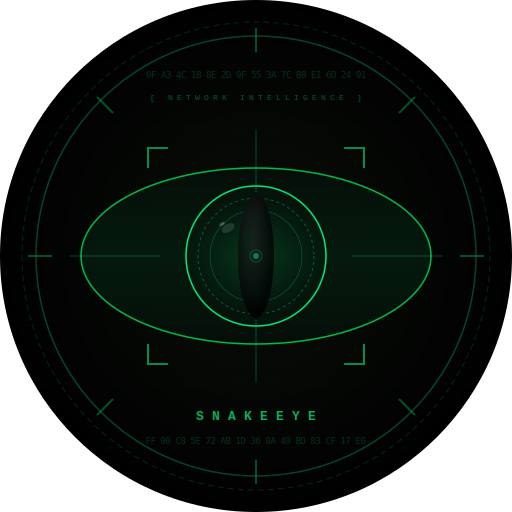

<div align="center">



# SnakeEye Analyzer

**Network Intelligence & Threat Analysis**


<br/>


<br/><br/>

*Passive and active intelligence gathering on IP addresses and network captures.*  
*Live packet capture. Geolocation. VPN detection. TLS inspection. Threat analysis.*

</div>

---

## Table of Contents

- [Overview](#overview)
- [Requirements](#requirements)
  - [Python](#python)
  - [Dependencies](#dependencies)
  - [Windows — Npcap](#windows--npcap)
  - [Linux / macOS](#linux--macos)
- [Installation](#installation)
- [Usage](#usage)
  - [Options](#options)
  - [Examples](#examples)
- [Live Capture](#live-capture)
  - [Workflow](#workflow)
  - [BPF Filter Examples](#bpf-filter-examples)
  - [Output Format](#output-format)
  - [Permissions](#permissions)
- [Analysis Modules](#analysis-modules)
  - [IP Intelligence](#ip-intelligence)
  - [Anonymizer & VPN Detection](#anonymizer--vpn-detection)
  - [Port Scan](#port-scan)
  - [PCAP Analysis](#pcap-analysis)
- [Output Structure](#output-structure)
- [Notes](#notes)
- [Legal Notice](#legal-notice)

---

## Overview


SnakeEye Analyzer is a command-line OSINT and network forensics tool for passive and active intelligence gathering on IP addresses and captured network traffic. It accepts individual IP addresses, PCAP/PCAPNG/ERF capture files, or both simultaneously, and produces structured terminal output covering geolocation, anonymizer detection, protocol analysis, TLS inspection, DNS intelligence, and threat indicators.

A built-in live capture engine allows traffic to be recorded directly from a network interface and written to a `.pcap` file, which can then be analyzed immediately within the same session.

---

## Requirements

### Python

Python 3.8 or newer.

### Dependencies

| Package | Purpose | Required |
|---------|---------|----------|
| `scapy` | PCAP parsing, packet dissection, live capture | For PCAP analysis and live capture |
| `colorama` | Terminal color output | Recommended |

Install all dependencies:

```
pip install scapy colorama
```

### Windows — Npcap

On Windows, Scapy requires **Npcap** for packet capture support. WinPcap is deprecated and not supported.

Download and install from: https://npcap.com

SnakeEye automatically detects and prioritizes Npcap at startup. If Npcap is present in `C:\Windows\System32\Npcap\`, it is injected into `PATH` before Scapy loads. A status line in the startup output confirms whether Npcap is active.

SnakeEye also enables ANSI/VT100 escape codes on Windows at startup via `SetConsoleMode`, ensuring that all colored output, spinner animations, and Unicode box-drawing characters render correctly in Windows Terminal and modern `cmd.exe` sessions.

> Running without Npcap on Windows will still allow IP analysis, but PCAP parsing and live capture will not function.

### Linux / macOS

No additional packet capture driver is required. Scapy uses libpcap directly.

Live capture requires root or `CAP_NET_RAW` capability:

```
sudo python3 snakeeye.py --capture
```

---

## Installation

No installation step is needed. Run directly from the script:

```
pip install scapy colorama
```

On Linux/macOS, make executable:

```
chmod +x snakeeye.py
```

---

## Usage

```
python snakeeye.py [OPTIONS]
```

At least one of `--ip`, `--pcap`, or `--capture` is required.

### Options

#### Analysis

| Flag | Argument | Description |
|------|----------|-------------|
| `-i`, `--ip` | `IP` | Target IP address to analyze |
| `-p`, `--pcap` | `FILE` | PCAP, PCAPNG, or ERF capture file |
| `--filter` | `IP` | Restrict PCAP analysis to a specific IP |
| `--portscan` | — | Active TCP connect scan on the target IP |
| `--json` | `FILE` | Export results to a JSON file |

#### Live Capture

| Flag | Argument | Description |
|------|----------|-------------|
| `--capture` | — | Start interactive live packet capture |
| `--list-interfaces` | — | Print available interfaces and exit |
| `--iface` | `IFACE` | Interface name or numeric index (skips prompt) |
| `--out` | `FILE` | Output `.pcap` file path |
| `--bpf` | `FILTER` | BPF capture filter expression |
| `--count` | `N` | Stop after N packets (0 = unlimited) |
| `--timeout` | `SEC` | Stop after SEC seconds (0 = unlimited) |
| `--no-analyze` | — | Skip automatic analysis after capture ends |

### Examples

Analyze a single IP address:

```
python snakeeye.py -i 8.8.8.8
```

Analyze an IP and perform a port scan:

```
python snakeeye.py -i 185.220.101.5 --portscan
```

Analyze a PCAP file:

```
python snakeeye.py -p capture.pcapng
```

Analyze a PCAP and filter output to one IP:

```
python snakeeye.py -p dump.pcap --filter 203.0.113.42
```

List available network interfaces:

```
python snakeeye.py --list-interfaces
```

Start interactive live capture (prompts for all settings):

```
python snakeeye.py --capture
```

Capture on a specific interface with a BPF filter, stop after 60 seconds, and auto-analyze:

```
python snakeeye.py --capture --iface eth0 --bpf "tcp port 443" --timeout 60
```

Capture 1000 packets on interface index 2, save to a named file, skip analysis:

```
python snakeeye.py --capture --iface 2 --count 1000 --out session.pcap --no-analyze
```

When both `--ip` and `--pcap` are supplied without `--filter`, the IP address from `--ip` is used as the PCAP filter automatically.

---

## Live Capture

### Workflow

Running `--capture` without additional flags starts an interactive session:

1. A formatted interface table is printed with index, name, IP address, and description.
2. The user selects an interface by index.
3. An output file name is prompted (defaults to `snakeeye_capture_YYYYMMDD_HHMMSS.pcap`).
4. An optional BPF filter expression is prompted.
5. An optional packet count limit and timeout are prompted.
6. Capture begins after a confirmation prompt.

During capture, a live status line updates in-place showing:

```
[>>>]  Packets:    412  Bytes:     128.3 KB  Rate:    68.7 pkt/s  Time:   6.0s  Press Ctrl+C to stop
```

Pressing `Ctrl+C` stops the capture cleanly. After capture ends (by limit, timeout, or interrupt), final statistics are printed and the user is offered the option to analyze the captured file immediately.

### BPF Filter Examples

| Expression | Captures |
|-----------|---------|
| `tcp port 443` | HTTPS traffic only |
| `host 10.0.0.1` | All traffic to/from a specific host |
| `tcp and not port 22` | All TCP except SSH |
| `udp port 53` | DNS queries and responses |
| `icmp` | ICMP packets only |
| `net 192.168.0.0/24` | Entire subnet |
| `port 80 or port 443` | HTTP and HTTPS |

### Output Format

Captured packets are written as a standard libpcap `.pcap` file (magic number `0xa1b2c3d4`, link type `LINKTYPE_ETHERNET`). The format is compatible with Wireshark, tcpdump, tshark, and SnakeEye's own analysis engine.

### Permissions

| Platform | Requirement |
|----------|------------|
| Windows | Run as Administrator, Npcap installed |
| Linux | `sudo` or `CAP_NET_RAW` on the Python binary |
| macOS | `sudo` required |

---

## Analysis Modules

### IP Intelligence

- IP space classification (global, private, loopback, multicast, link-local, IPv4/IPv6)
- Reverse DNS resolution
- GeoIP lookup via ip-api.com with fallback to ipinfo.io
- Country, region, city, coordinates, timezone
- ISP, organization, ASN, AS name
- Google Maps link from coordinates

### Anonymizer & VPN Detection

Scoring system from 0 to 100 based on multiple heuristics:

- API-level proxy/VPN flag from GeoIP provider
- Keyword matching against 45+ known VPN provider names (NordVPN, Mullvad, ProtonVPN, ExpressVPN, etc.)
- Datacenter and cloud provider detection (DigitalOcean, Hetzner, OVH, AWS, Azure, etc.)
- Tor exit node verification via live DNS query to `dnsel.torproject.org`
- Score thresholds: Clean (0–30), Suspicious (31–60), High Risk (61–100)

### Port Scan

Active TCP connect scan across 14 commonly significant ports with a 0.5-second timeout per port. Flagged categories:

- **Suspicious ports**: 4444, 1337, 31337, 6666, 9050, 9051, and others
- **Tunnel/VPN ports**: 1194 (OpenVPN), 1723 (PPTP), 500/4500 (IPSec/IKE), 51820 (WireGuard), 1080 (SOCKS)

> The port scan generates active network traffic. Use only on systems you are authorized to test.

### PCAP Analysis

Supported formats: `.pcap`, `.pcapng`, `.erf`

**Statistics**

- Total packet count, byte count, capture duration
- Average packet rate (pkt/s) and throughput (KB/s)
- Shannon entropy across all payloads (indicator for encrypted or compressed traffic)

**Protocol Breakdown**

Per-protocol packet counts and percentages for TCP, UDP, ICMP, DNS, ARP, and others.

**Traffic Analysis**

- Top 10 source IPs and destination IPs by packet count
- Top 15 destination ports with service name mapping
- Top 8 conversations by byte volume
- ARP table reconstruction (IP to MAC mapping)

**TCP Flag Analysis**

Per-flag counts with heuristic detection of SYN scans and SYN flood conditions.

**ICMP Breakdown**

Type classification including Echo Request/Reply, Destination Unreachable, TTL Exceeded, Redirect, and Traceroute.

**DNS Intelligence**

- Extraction of all DNS query names
- DGA (Domain Generation Algorithm) heuristic based on label length and consonant ratio
- Darknet TLD detection: `.onion`, `.i2p`, `.bit`

**HTTP Host Header Extraction**

Cleartext HTTP traffic on ports 80, 8080, and 8888 is parsed for `Host:` headers, exposing contacted domains without TLS.

**TLS / Encryption Analysis**

Manual ClientHello parser (no external TLS library required):

- Record version and ClientHello version
- SNI (Server Name Indication) hostname extraction
- Number of offered cipher suites and first eight suite identifiers
- TLS version classification: SSL 3.0 and TLS 1.0/1.1 flagged as deprecated

**Threat Indicators**

Automated aggregation of anomalies across all modules:

| Indicator | Condition |
|-----------|-----------|
| SYN scan / flood | High SYN count, ACK ratio below 10% |
| Suspicious port traffic | More than 5 packets to a flagged port |
| Tor SOCKS proxy | Traffic to port 9050 or 9051 |
| Tunneling activity | VPN/tunnel port with significant traffic |
| Cleartext exposure | HTTP Host headers present |
| High payload entropy | Entropy above 7.2 bits/byte on substantial data |
| DGA domains | DNS queries matching algorithmic name patterns |

---

## Output Structure

All output is written to stdout with ANSI color coding. Sections are delimited by labeled separators. The startup sequence includes animated spinners and progress bars to indicate active operations. On Windows, VT100 processing is enabled automatically at startup.

| Color | Meaning |
|-------|---------|
| Cyan | Labels, section headers, neutral information |
| Green | Confirmed safe, success states, open ports |
| Yellow | Warnings, intermediate risk, notable values |
| Red | Critical findings, high-risk indicators, confirmed threats |
| Magenta | TLS/connection details, section markers |

---

## Notes

- All external lookups (GeoIP, Tor exit check) require an active internet connection. The tool degrades gracefully if requests fail.
- The GeoIP API (ip-api.com) applies rate limiting on free usage. Repeated rapid queries may return empty results.
- Private, loopback, and reserved IP addresses skip external lookups.
- Colorama is optional. If not installed, output falls back to plain text with no color codes.
- The `--json` flag is implemented in the argument parser but output is currently basic. Full structured export can be extended.
- Live capture writes packets immediately to disk as they arrive. Large captures on high-throughput interfaces can produce large files.

---

## Legal Notice

> This tool is intended exclusively for authorized security research, penetration testing on systems with explicit written permission, and academic network analysis. Unauthorized use against third-party systems may violate applicable law. The user bears full responsibility for compliance with local regulations.

---

<div align="center">

<br/>
<sub><code>SnakeEye Analyzer — Research Edition — For authorized use only</code></sub>
</div>
